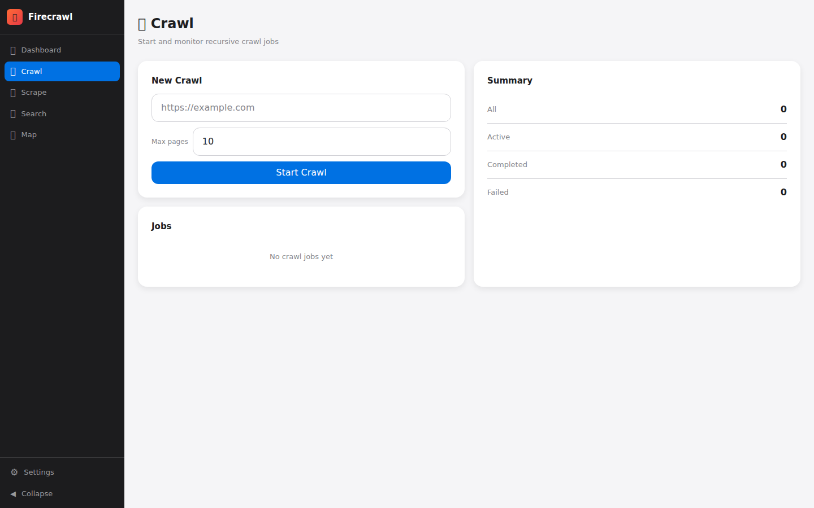
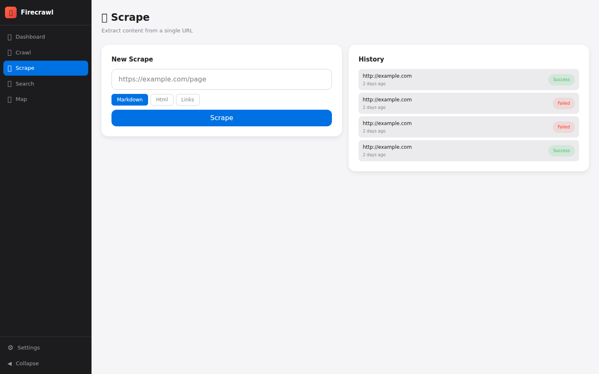
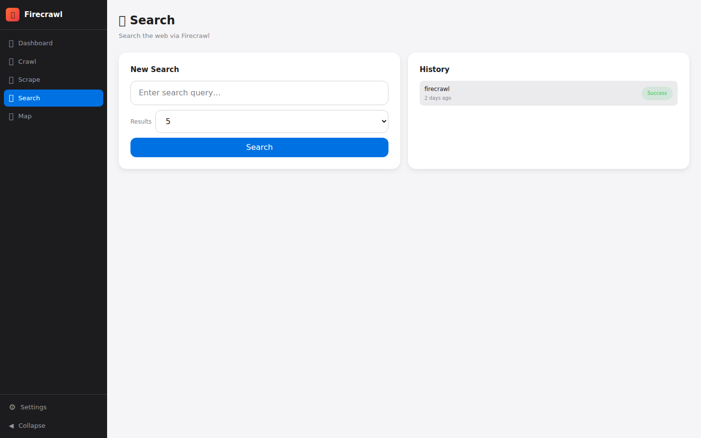
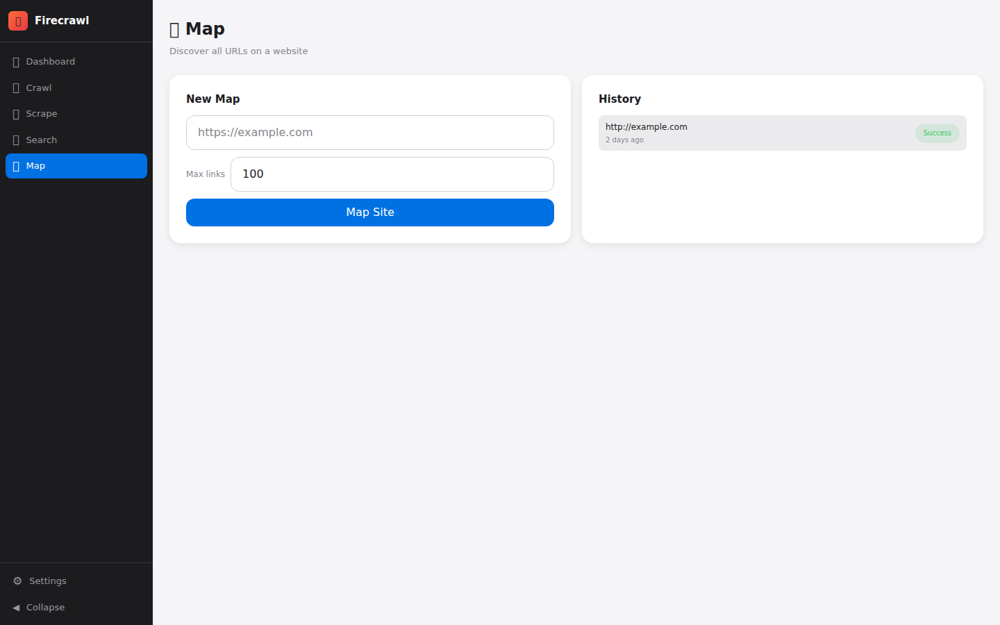
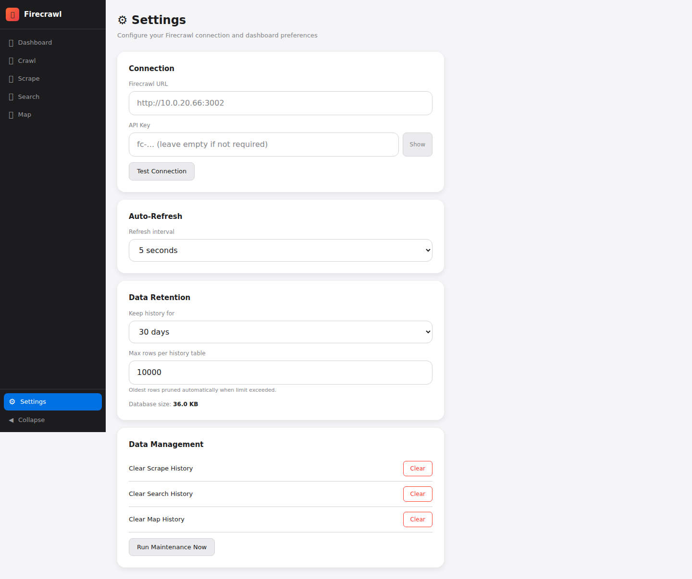

# Firecrawl Dashboard

A self-hosted monitoring dashboard for [Firecrawl](https://github.com/mendableai/firecrawl) instances. Built with React and Express, styled with an Apple Design System theme that supports light and dark mode.


## Features

- **Crawl Management** — Create, monitor, and cancel crawl jobs with live progress tracking
- **URL Scraping** — Scrape any URL and view results in markdown, HTML, or raw links
- **Web Search** — Search the web through Firecrawl with configurable result limits
- **Site Mapping** — Discover all URLs on a website
- **Dashboard Analytics** — Activity charts, success rate breakdown, top domains, live crawl progress
- **Auto-Save Settings** — Apple HIG-style instant-apply settings with connection testing
- **Dark Mode** — Automatic light/dark mode via `prefers-color-scheme`
- **Persistent Storage** — SQLite database for operation history, settings, and crawl state
- **Auto-Maintenance** — Configurable data retention with automatic pruning

## Screenshots

| Dashboard | Crawl | Scrape |
|:-:|:-:|:-:|
|  |  |  |

| Search | Map | Settings |
|:-:|:-:|:-:|
|  |  |  |

## Quick Start

### Docker Compose (Recommended)

Create a `docker-compose.yml`:

```yaml
services:
  firecrawl-dashboard:
    image: ghcr.io/tekgnosis-net/firecrawl-dashboard:latest
    pull_policy: always
    container_name: firecrawl-dashboard
    ports:
      - "3003:3000"
    environment:
      - FIRECRAWL_URL=http://your-firecrawl-host:3002
    volumes:
      - ./data:/app/data
    restart: unless-stopped
    healthcheck:
      test: ["CMD", "wget", "--quiet", "--tries=1", "--spider", "http://localhost:3000/api/health"]
      interval: 30s
      timeout: 10s
      retries: 3
      start_period: 10s
```

```bash
docker compose up -d
```

Open **http://localhost:3003** and configure your Firecrawl connection in Settings.

### From Source

```bash
git clone https://github.com/tekgnosis-net/firecrawl-dashboard.git
cd firecrawl-dashboard
npm install
npm run dev    # Vite on :3000 + Express on :3001
```

## Configuration

### First-Time Setup

1. Open the dashboard at http://localhost:3003
2. Go to **Settings** (sidebar)
3. Enter your Firecrawl URL and API key (if auth is enabled)
4. Settings save automatically — no save button needed
5. Use **Test Connection** to verify

### Environment Variables

| Variable | Default | Description |
|----------|---------|-------------|
| `PORT` | `3000` | Server port (internal) |
| `FIRECRAWL_URL` | — | Firecrawl API URL (fallback if not set in Settings) |
| `FIRECRAWL_API_KEY` | — | API key (fallback if not set in Settings) |

Settings configured via the UI are persisted in SQLite and take priority over environment variables.

### Data Persistence

The SQLite database is stored at `/app/data/dashboard.db` inside the container. Mount a volume to `./data:/app/data` to persist data across container restarts. The entrypoint script automatically fixes directory permissions if the host directory is created by Docker as root.

## Architecture

```
Browser  ──►  Vite (dev) / Express (prod)  ──►  Firecrawl API
                     │
                     ▼
               SQLite (data/dashboard.db)
```

**Frontend** — React 18 SPA with React Router v7, Zustand for state, Recharts for charts, Tailwind CSS with Apple Design System tokens. Six pages: Dashboard, Crawl, Scrape, Search, Map, Settings.

**Backend** — Express.js proxy to Firecrawl API. Persists operation history, crawl jobs, and settings to SQLite via `better-sqlite3`. Automatic housekeeping prunes old records based on configurable retention.

**API proxy** — Frontend calls `/api/*` which Vite proxies in dev, Express handles directly in production. SPA fallback serves `index.html` for client-side routes.

## API Endpoints

| Endpoint | Method | Description |
|----------|--------|-------------|
| `/api/health` | GET | Health check and Firecrawl connectivity |
| `/api/stats` | GET | Aggregate statistics |
| `/api/stats/daily` | GET | Daily activity breakdown |
| `/api/stats/domains` | GET | Top scraped domains |
| `/api/stats/dbsize` | GET | Database size |
| `/api/settings` | GET/POST | Read/write dashboard settings |
| `/api/crawls` | GET/POST | List/create crawl jobs |
| `/api/crawls/:id` | GET | Crawl job detail with progress |
| `/api/crawls/:id/cancel` | POST | Cancel a running crawl |
| `/api/scrape` | POST | Scrape a URL |
| `/api/search` | POST | Search the web |
| `/api/map` | POST | Map URLs from a site |
| `/api/history/:type` | GET/DELETE | Operation history (scrape/search/map) |
| `/api/maintenance` | POST | Trigger manual housekeeping |

## License

MIT — see [LICENSE](./LICENSE)

---

Built by [Tekgnosis](https://tekgnosis.net)
