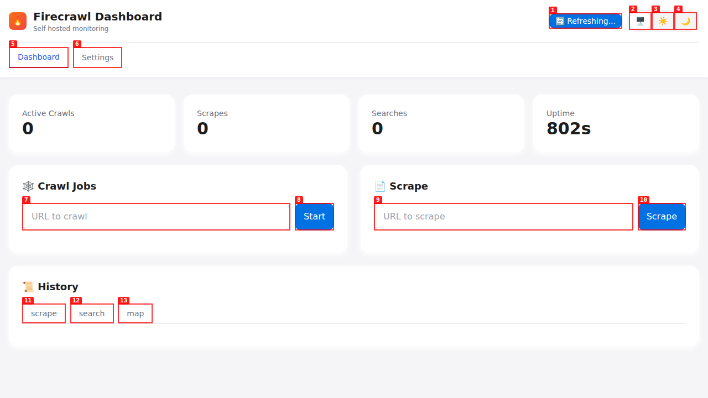
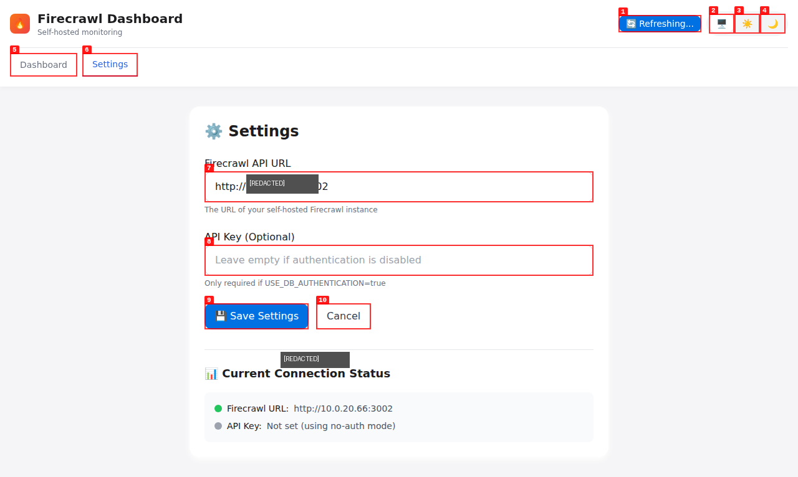

# 🔥 Firecrawl Dashboard

A beautiful monitoring dashboard for self-hosted Firecrawl instances with Apple Design System styling.

## ✨ Features

- **🕸️ Crawl Job Management** - Create and monitor crawl jobs in real-time
- **📄 URL Scraping** - Scrape any URL and view markdown content
- **🔍 Web Search** - Search the web using Firecrawl
- **🗺️ Site Mapping** - Discover all URLs on a website
- **📊 Real-time Statistics** - Live stats on active crawls, scrapes, searches
- **⚙️ Settings Configuration** - Configure Firecrawl URL and API key via GUI
- **🔄 Auto-Refresh** - Automatic updates every 30 seconds
- **🎨 Theme Support** - Auto/System/Light/Dark mode with system preference detection
- **🍎 Apple Design** - Beautiful UI inspired by Apple's design language

## 📸 Screenshots

### Dashboard Overview



The main dashboard shows:
- Real-time statistics (Active Crawls, Scrapes, Searches, Uptime)
- Crawl job creation and monitoring
- URL scraping interface
- History tabs for scrapes, searches, and maps

### Settings Configuration



The Settings tab allows you to:
- Configure your self-hosted Firecrawl instance URL
- Set API key (if authentication is enabled)
- View current connection status

## 🚀 Quick Start

### Docker Compose (Recommended)

```bash
git clone https://github.com/tekgnosis-net/firecrawl-dashboard.git
cd firecrawl-dashboard
docker-compose up -d
```

Access the dashboard at **http://localhost:3003**

## 📖 Configuration

### First-Time Setup

1. **Start the dashboard** using Docker Compose or manually
2. **Open the dashboard** at http://localhost:3003
3. **Go to Settings tab** (⚙️ icon)
4. **Configure your Firecrawl instance:**
   - Enter your Firecrawl URL (e.g., `http://localhost:8080` or `http://your-server-ip:3002`)
   - Enter API key if authentication is enabled (leave empty if `USE_DB_AUTHENTICATION=false`)
5. **Click "Save Settings"**
6. **Return to Dashboard** to start using the interface

### Environment Variables

| Variable | Default | Description |
|----------|---------|-------------|
| `PORT` | `3000` | Dashboard server port (internal) |
| `FIRECRAWL_URL` | `http://firecrawl:3002` | Firecrawl API URL (can be changed in Settings) |

### Port Mapping

When running with Docker, map the internal port 3000 to your desired host port:

```yaml
ports:
  - "3003:3000"  # Host:Container mapping
```

This makes the dashboard accessible at `http://localhost:3003`

## 🐳 Docker Services

- **firecrawl-dashboard** - The monitoring dashboard (port 3003)
- **firecrawl** - Firecrawl scraping engine (port 3002)
- **firecrawl-db** - PostgreSQL database
- **firecrawl-redis** - Redis cache

## 🛠️ Usage

### Creating a Crawl Job
1. Enter the URL to crawl in the "🕸️ Crawl Jobs" section
2. Click "Start"
3. Monitor progress in real-time (auto-refreshes every 30 seconds)

### Scraping a URL
1. Enter the URL to scrape in the "📄 Scrape" section
2. Click "Scrape"
3. View markdown content and metadata in the History tab

### Manual Refresh
Click the "🔄 Refresh" button in the top-right corner to manually refresh all data.

## 🔧 Troubleshooting

### Dashboard doesn't show crawl updates

**Problem:** The dashboard shows 0 crawls/scrapes even though you're running tests.

**Solution:**
1. Open the dashboard and go to **Settings** tab
2. Verify the **Firecrawl URL** matches your self-hosted instance
3. Check if API key is required (only if `USE_DB_AUTHENTICATION=true`)
4. Save settings and return to Dashboard
5. Click **Refresh** button or wait for auto-refresh

### Connection errors

**Problem:** Dashboard shows connection errors or can't reach Firecrawl.

**Solutions:**
- Verify your Firecrawl instance is running: `curl http://your-firecrawl-url:port/api/v1/status`
- Check firewall rules allow connections from dashboard to Firecrawl
- Ensure port mapping is correct (Firecrawl typically runs on port 3000 internally)
- If using Docker, check network connectivity between containers

### Port conflicts

**Problem:** Can't access the dashboard.

**Solution:**
- The dashboard runs on port **3000** internally (not 3001!)
- Map it correctly in docker-compose: `ports: ["3003:3000"]`
- Access at the host port (e.g., `http://localhost:3003`)

## 📊 API Endpoints

| Endpoint | Method | Description |
|----------|--------|-------------|
| `/api/health` | GET | Health check |
| `/api/stats` | GET | Get statistics |
| `/api/crawls` | GET/POST | List/create crawl jobs |
| `/api/scrape` | POST | Scrape a URL |
| `/api/search` | POST | Search the web |
| `/api/map` | POST | Map URLs from a site |

## 📄 License

MIT License - see [LICENSE](./LICENSE) file

## 📦 Version

**Current Version:** 1.0.0 (2026-04-08)

### Changelog

#### [1.0.0] - 2026-04-08
**Major release with Settings tab and auto-refresh**

**Added:**
- Settings tab for Firecrawl URL and API key configuration
- Auto-refresh polling every 30 seconds
- Manual refresh button
- Theme selector (Auto/System/Light/Dark)
- System preference detection for dark/light mode
- Connection status indicator

**Fixed:**
- API integration to use dynamic URL from database
- Bearer token authentication support
- Port mapping (corrected from 3001 to 3000)
- Docker build context and configuration

**Changed:**
- Upgraded from Node 20 to Node 22
- Removed deprecated 'version' parameter from docker-compose

---

Built with ❤️ by [Tekgnosis Pty Ltd](https://tekgnosis.net)
